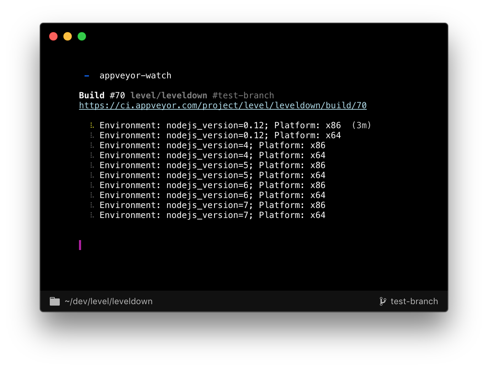

# appveyor-watch 

Stream live appveyor test results of the current commit to your terminal. Exits with the proper exit code too!



## Installation

```bash
$ npm install -g appveyor-watch
```

## Usage

```bash
$ appveyor-watch --help
Usage: appveyor-watch [DIRECTORY]
```

## JavaScript API

```js
const differ = require('ansi-diff-stream')
const render = require('render-ci-matrix')()
const Watch = require('appveyor-watch')

const diff = differ()
diff.pipe(process.stdout)

const watch = new Watch(process.cwd())
watch.start()

setInterval(
  () => diff.write(render(watch.state)),
  100
)

watch.on('finish', () => {
  diff.write(render(watch.state))
  process.exit(!watch.state.success)
})
```

## Kudos

- Development of this module is sponsored by the [Dat Project](https://datproject.org/).

## Related

- __[travis-watch](https://github.com/juliangruber/travis-watch)__ &mdash; Stream live travis test results of the current commit to your terminal!
- __[ansi-diff-stream](https://github.com/mafintosh/ansi-diff-stream)__ &mdash; A transform stream that diffs input buffers and outputs the diff as ANSI. If you pipe this to a terminal it will update the output with minimal changes
- __[render-ci-matrix](https://github.com/juliangruber/render-ci-matrix)__ &mdash; Render a CI results matrix to the terminal.

## License

MIT
